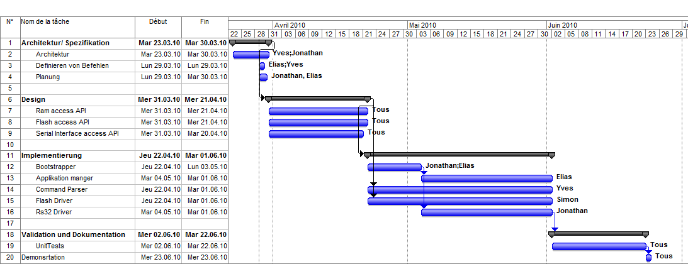

Anlagen
=======

Anlage 1: Planung
-----------------

Das folgende Bild zeigt die Großplanung für das Bootloader Projekt. Diese Planung wird während der Entwicklung kontinuierlich aktualisiert.

Ein (Druck-geeignetes) PDF und das originale MS Project Dokument sind auch verfügbar:

* `Planung PDF Dokument <../static/planung.pdf>`_
* `Planung MS Project Dokument <../static/planung.mpp>`_

Anlage 2: Entwicklungs-prozess
----------------------------------------------

Das ganze Projekt wird auf github (http://github.com) verwaltet.

* Git Repository auf github: http://github.com/garetjax/Bootloader

.. todo::
   * Add description of the documentation build process.

Anlage 3: Ressourcen
--------------------

Interne ressourcen
~~~~~~~~~~~~~~~~~~

 * HTML Build der dokumentation: http://garetjax.github.com/Bootloader
 * HTML Build der spezifikation: http://garetjax.github.com/Bootloader/api/
 * PDF Build der dokumentation: http://garetjax.github.com/Bootloader/static/documentation.pdf
 * PDF Build der spezifikation: http://garetjax.github.com/Bootloader/static/api.pdf

Externe ressourcen
~~~~~~~~~~~~~~~~~~

 * Git: http://git-scm.com/
 * Sphinx: http://sphinx.pocoo.org
 * Doxygen: http://www.stack.nl/~dimitri/doxygen/

Anlage 4: Referenzen
--------------------

.. todo::
   * Referenzen liste

Anlage 3: TODOs
---------------

Sphinx ermöglicht das direkte Einfügen von *zu tun* Elemente in der Dokumentation.
Diese Elemente können während des Builds durch eine Konfigurationsoption ausgeblendet werden.

Um ein neues *zu tun* Element hinzuzufügen, ist die folgende Syntax zu verwenden:

::

  .. todo::
     A simple text describing what we have to do.
     * But it could be
     * a list too
     * if the points are many

Diese Elemente können durch die folgende Syntax in einer Auflistung zusammengefasst werden:

::
   
   .. todolist::
   
Hier unten sind alle, in der Dokumentation gefundene, *zu tun* Element aufgelistet (falls sie aktiviert sind).

.. todolist::