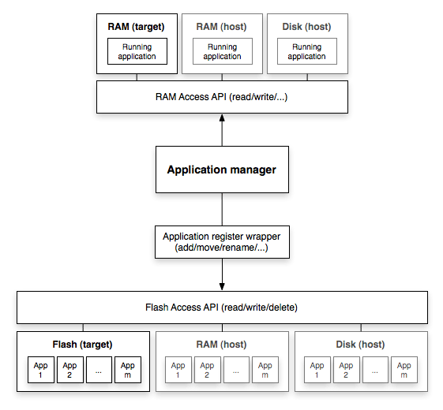

Architektur
===========

Überblick
---------

Application Manager
-------------------

Die Aufgabe der Application Manager ist es, den Applikations-verzeichnis zu
verwalten und den aktuellen Ihnalt des Flashspeichers in den Arbeitsspeicher zu laden.

Flash Access API
~~~~~~~~~~~~~~~~

Mit der Flash Access API können entweder Flashspeicher, Arbeitsspeicher oder
Festplatte benutzt werden. Die drei Hauptfunktionen der API werden lesen,
schreiben und löschen sein.
Der Zugriff auf den Flashspeicher ist nur mittels Mikrokontroller MC68332 möglich (Zielplattform). 
Lesen und/oder Schreiben auf Arbeitsspeicher oder Festplatte sind für Testzwecke gedacht (Debugging).

Application Register Wrapper
~~~~~~~~~~~~~~~~~~~~~~~~~~~~

Damit wir nicht direkt mit der Flash API gearbeitet werden muss, übernimmt der
Application Register Wrapper die Ansteuerung der Flash Access API. Dies
erleichtert das Entwickeln des Bootloaders und ermöglicht den Code des
Application Manager übersichtlich zu gestalten.

Serial Interface Driver
-----------------------

.. image:: images/serial-driver.png

Der Serial Interface Driver ermöglicht die Kommunikation zwischen Zielplattform (MC68332)
und Benutzer des Bootloader. Mittels eines Keyboards und einem Terminal werden
Zeichen an den Mikrokontroller geschickt und das Resultat vom Kontroller
anschliessend wieder an den Benutzer zurück geschickt. Funktionen wie
put_char oder get_char müssen hier implementiert werden.
Damit wir die Serielle Schnittstelle in unserer Testumbebung emulieren können werden wir ein Socket benutzen.

Command Parser
--------------

Der Command Parser analysiert die einkommenden Befehle des Benutzerkeyboards
und delegiert das Aufrufen der entsprechenden Methoden (siehe Commands).
